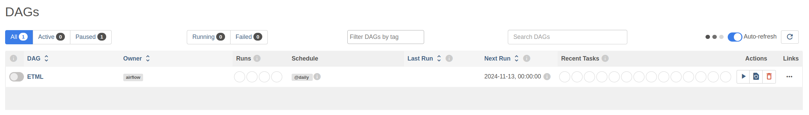
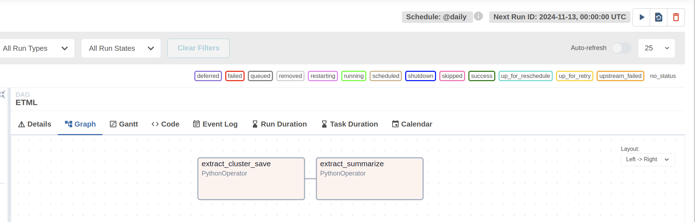

# [name] An Extract, Transform, Machine Learning Application

[name] aims to assist a tech-savvy taxi company, operating a fleet of thousands of vehicles, in achieving greater consistency in ride times and a deeper comprehension of longer journeys. By addressing these, [name] intends to improve the customer experience, thereby, increase retention and return business.

[name] offers the following key features:

- **Anomaly Detection**: Identifies rides with atypical ride time or ride length behaviors through clustering analysis. By clustering rides based on distance and time features, outliers are detected and flagged within the company's internal analysis tool;
- **Daily Reporting**: Generates comprehensive daily reports, for anomalous rides, by integrating traffic news, call transcripts, and core ride information. These reports are stored in the designated data location for future reference and analysis;

## Requirements

[name] satisfies the following requirements:

- Rides should be clustered based on ride distance and time, and anomalies/outliers identified;
- Speed (distance/time) was not to be used, as analysts would like to understand long-distance rides or those with long duration;
- The analysis should be carried out on a daily schedule;
- The data for inference should be consumed from the company’s data lake;
- The results should be made available for consumption by other company systems;
- The system’s results should contain information on the ride classification as well as a summary of relevant textual data;
- Only anomalous rides need to have textual data summarized;

## Users Stories

- **User story 1**: As an operations analyst or data scientist, I want to be given clear labels of rides that are anomalous when considering their ride times in minutes and ride distances in miles so that I can perform further analysis and modeling on the volume of anomalous rides. The criteria for what counts as an anomaly should be determined by an appropriate ML algorithm, which defines an anomaly concerning the other rides for the same day;
- **User story 2**: As an operations analyst or data scientist, I want to be provided with a summary of relevant textual data so that I can do further analysis and modeling on the reasons for some rides being anomalous;
- **User story 3**: As an internal application developer, I want all output data sent to a central location, preferably in the cloud, so that I can easily build dashboards and other applications with this data;
- **User story 4**: As an operations analyst or data scientist, I would like to receive a report every morning by 09.00. This report should clearly show which rides were anomalous or “normal” as defined by the selected ML algorithm. This will enable me to update my analyses and provide an update to the logistics managers.

## Solution

The requirements clearly point us to a solution that takes in some data and augments it with ML inference, before outputting the data to a target location. Any design we come up with must encapsulate these steps. This is the description of any ETML solution, and this is one of the most used patterns in the ML world.

The following image illustrates the pipeline's workflow.


The pipeline is designed by Apache Airflow. Apache Airflow is a platform to programmatically author, schedule, and monitor workflows.
The pipeline is composed of the following steps:

- Data Extraction: for the sake of simplicity, we consider that the ride data (time, speed, traffic, news, and weather) are collected in a local directory (_source_);
- Clustering:
- Save Clustering Results: the clustering results are saved in a local directory (_cdata_):
- Clustered Data Extraction: for the reports generation the clustered data are extracted from the directory (_cdata_):
- Data Summarization: the data summarization is achieved using a Large Language Model (LLM). We deploy the LLM locally through Ollama.
- Save Summarization Results: the generated reports are saved in a local directory (_reports_) in order to get them available.

## Prerequisites for Windows Users

Airflow is not compatible with Windows, so it is necessary to use WSL (Windows Subsystem for Linux).

To install WSL, open PowerShell and execute the following command:

```powershell
    wsl --install
    # Then, type exit.
```

Navigate to the directory where the repository was cloned using the ```cd``` command and launch WSL: ```wsl```.

This will open the shell in the local (Windows) directory but mounted in Ubuntu.

The commands in the rest of this README should be executed from this shell.

If you have Visual Studio Code (VSCode), you can open this project by using the command ```code .```. This will launch VSCode on Windows, while the code will be executed in the Ubuntu environment.

## Deploying LLM Locally with Ollama

[Ollama](https://ollama.com/) is a powerful tool enabling the local execution of large language models (LLMs). By leveraging local hardware, users can operate advanced AI models without relying on cloud-based services. </br>
Ollama provides access to a variety of pre-optimized models, including Phi-3.5-mini. This state-of-the-art, lightweight model is trained on high-quality, factual data derived from synthetic sources and carefully curated public websites. </br>
To install Ollama, download it from the official [website](https://ollama.com/download)

For Windows users, it is essential to use the Linux installation (always within the WSL shell).

Now, we can pull an LLM from the Ollama registry.

```
    cristian@cristian-msi:~$ ollama pull phi3.5
    pulling manifest
    pulling b5374915da53... 100% ▕████████████████▏ 2.2 GB
    pulling c608dc615584... 100% ▕████████████████▏  149 B
    pulling c5f9f560a704... 100% ▕████████████████▏ 1.1 KB
    pulling 45ac4c662a77... 100% ▕████████████████▏   60 B
    pulling 0611867ea67b... 100% ▕████████████████▏  409 B
    verifying sha256 digest
    writing manifest
    removing any unused layers
    success
```

Following this, we can initiate the model and provide it with a prompt.

```
    cristian@cristian-msi:~$ ollama run phi3.5
    >>> Hi! Who are you?
    Hello! I'm Phi, an artificial intelligence designed to engage in
    conversation and provide information. How can I help you today?
```

## Install and Configure Airflow

It is highly recommended to establish a conda environment and install required packages within this isolated environment. </br>
```
    conda create -n LLM_APP python=3.10
    conda activate LLM_APP
```

Install Airflow by executing the following commands from the repository's root directory:

```
    export AIRFLOW_HOME=/airflow
    AIRFLOW_VERSION=2.10.3
    PYTHON_VERSION=3.10

    CONSTRAINT_URL="https://raw.githubusercontent.com/apache/airflow/constraints-${AIRFLOW_VERSION}/constraints-${PYTHON_VERSION}.txt"
    pip install "apache-airflow==${AIRFLOW_VERSION}" --constraint "${CONSTRAINT_URL}"
```

Start Airflow:

```
    cristian@cristian-msi:~$ NO_PROXY="*" AIRFLOW_HOME="$(pwd)/airflow" airflow standalone
    ...
    webserver  | [2024-11-14 12:07:38 +0100] [87748] [INFO] Starting gunicorn 23.0.0
    webserver  | [2024-11-14 12:07:38 +0100] [87748] [INFO] Listening at: http://0.0.0.0:8080 (87748)
    webserver  | [2024-11-14 12:07:38 +0100] [87748] [INFO] Using worker: sync
    webserver  | [2024-11-14 12:07:38 +0100] [87866] [INFO] Booting worker with pid: 87866
    webserver  | [2024-11-14 12:07:38 +0100] [87867] [INFO] Booting worker with pid: 87867
    webserver  | [2024-11-14 12:07:38 +0100] [87868] [INFO] Booting worker with pid: 87868
    webserver  | [2024-11-14 12:07:38 +0100] [87869] [INFO] Booting worker with pid: 87869
    standalone | Airflow is ready
    standalone | Login with username: admin  password: Hpbx7PQfu9nE4FxQ
    standalone | Airflow Standalone is for development purposes only. Do not use this in production!
```

The airflow standalone command initializes the database, creates a user, and starts all components. </br>
Airflow's user interface is accessible at http://localhost:8080. The necessary credentials (username and password) can be found in the output of the preceding command.

The DAG section shows a lot of examples, if you want to remove them, change the _load_example_ in the _airflow/airflow.cfg_ file:

```
    # Whether to load the DAG examples that ship with Airflow. It's good to
    # get started, but you probably want to set this to ``False`` in a production
    # environment
    #
    # Variable: AIRFLOW__CORE__LOAD_EXAMPLES
    #
    load_examples = False
```

Airflow defines a directory where it searches the DAGs (pipelines). The directory path is set in the _airflow/airflow.cfg_ file. </br>
Set _/dags/_ as Airflow DAGs directory:

```
    # The folder where your airflow pipelines live, most likely a
    # subfolder in a code repository. This path must be absolute.
    #
    # Variable: AIRFLOW__CORE__DAGS_FOLDER
    #
    dags_folder = /{path to repo}/dags
```

Even if you now restart the standalone process, the example DAGs may still show up as they are persisted in the database. </br>
Therefore, we also need to reset the database accordingly with the following command.

```
    NO_PROXY="*" AIRFLOW_HOME="$(pwd)/airflow" airflow db reset
    NO_PROXY="*" AIRFLOW_HOME="$(pwd)/airflow" airflow standalone
```

Note: Before executing the database reset, ensure that Airflow is stopped.

## Pipeline

The pipeline implementation is located in the _dags_ directory.

Install the required packages:

```
    pip install pandas
    pip install scikit-learn
    pip install ollama
```

Create the data directory structure:
```
    mkdir data
    mkdir data/source
    mkdir data/cdata
    mkdir data/reports
```

### Dag Definition

The DAG is defined in the _dags/pipeline_etml.py_ script and comprises two operators: _extract_cluster_save_ and _extract_summarize_.

extract_summarize

The pipeline will be executed daily, so the _scedule_interval_ is set as _@daily_.

```
with DAG(
    dag_id="ETML",
    start_date=pendulum.datetime(2024, 10, 14),
    schedule_interval="@daily",
    catchup=False,
) as dag:
```

Given the daily operational schedule, the pipeline must generate daily reports. This necessitates access to the corresponding day's data. </br>
To facilitate this, the file name of the data source is dynamically constructed based on the current date

```
    date = datetime.datetime.now().strftime("%Y%m%d")
    file_name = f"taxi-rides-{date}.json"
```

### Cluster

This component is responsible for extracting source data, detecting anomalous taxi rides (by clustering) and saving the clustering results.
We assume that the monitoring system for taxi rides collects data in JSON format. The structure of this JSON data is as follows:

```
    {
        "ride_dist": 1.4468849204,
        "ride_time": 0.1884502403,
        "ride_speed": 7.6778088376,
        "ride_id": "20241119399",
        "selection_idx": 1,
        "news": "It is expected to be a busy shopping day today as many retailers attempt are offering discounts to try to lure shoppers
        back into city centre stores after the COVID-19 pandemic and lockdown. Many are expected to make there way into Glasgow city centre today
        to take advantage of the discounts on offer. There is also an expected surge in activity on online shopping sites.",
        "weather": "The weather is expected to be sunny and dry over the next few days, with temperatures in the mid-teens looking set to entice people out and about.",
        "traffic": "Traffic is expected to be heavy on the M8 motorway near Glasgow today due to an influx of shoppers into the city centre."
  }
```

Therefore, the data extraction process is straightforward:

```
    df = pd.read_json(os.path.join('./data/source', self.file_name))
```

The Density-Based Spatial Clustering of Applications with Noise (DBSCAN) algorithm is exploited in order to detect the anomalies.

```
    df_features = StandardScaler().fit_transform(df_features)
    db = DBSCAN(**self.model_params).fit(df_features)

    # Find labels from the clustering
    core_samples_mask = np.zeros_like(db.labels_, dtype=bool)
    core_samples_mask[db.core_sample_indices_] = True
    labels = db.labels_
```

Lastly, the existing dataset is augmented with a label feature. This feature indicates whether a given taxi ride is anomalous, assigning a label value of -1 to anomalous instances.

```
    # Add labels to the dataset and return.
    df['label'] = labels
    df.to_json(path_or_buf=os.path.join('./data/cdata/',
                                            self.file_name), orient='records')
```

### Summarization

This component processes the output of the preceding step, filtering for anomalous taxi rides.
Reports are then generated and stored for each identified anomaly.

The following code snippet processes clustered data by generating prompts and summaries for each anomalous taxi ride, which are then appended to the existing dataset.

```
    df = pd.read_json(os.path.join('./data/cdata', self.file_name))

    df_anomaly = df[df.label == -1].reset_index(drop=True)
    df_anomaly['summary'] = ''

    df_anomaly['prompt'] = df_anomaly.apply(lambda x: self.format_prompt(
            x['news'], x['weather'], x['traffic']), axis=1)

    df_anomaly.loc[:, 'summary'] = df_anomaly['prompt'].apply(
            lambda x: self.generate_summary(x))

```

The prompts are generated as follows:

```
    def format_prompt(self, news: str, weather: str, traffic: str) -> str:
        prompt = dedent(f'''
        <|system|>
        You are a helpful assistant.<|end|>
        <|user|>
        The following information describes conditions relevant to
        taxi journeys through a single day in Glasgow, Scotland.
        News: {news}
        Weather: {weather}
        Traffic: {traffic}
        Summarize the above information in 3 sentences or less.< |end | >
        <|assistant|>
        ''')
        return prompt
```

The format used is advised by the creator of Phi3.5 (Microsoft).
This prompt follows the same format used in the training of the LLM and it are composed by:

- System prompt: An instruction to guide the LLM behavior and responses. It sets the context
  and tone for the interaction, ensuring the output aligns with desired goals;
- User prompt: The question and context for the LLM;

The prompt terminates with _<|assistant|>_, which specifies to the LLM to initiate the generation.

The prompt is provided to the LLM as follows:

```
    def generate_summary(self, prompt: str) -> str:
        response = ollama.generate(model='phi3.5', prompt=prompt)
        return response['response']
```

An example of generates summary is:

```
    "summary": "Today, many retailers in Glasgow are offering discounts to attract customers back into their stores following COVID-19 restrictions and lockdown measures; this surge coincides with sunny weather expected throughout the day. The city center will see a significant increase in foot traffic as shoppers take advantage of these deals, further contributing to heavy traffic on nearby motorways like the M8. Meanwhile, online shopping activity is also anticipated to rise due to favorable conditions and promotions both offline and digitally."
```

## Test Pipeline

The pipeline is scheduled to execute daily. To initiate a manual test, access the Airflow dashboard and trigger a pipeline run.
The pipeline relies on a source data file located in the _data/source_ directory. </br> This file must adhere to the naming convention: _taxi-rides-{current date}.json_. </br> A sample JSON dataset is provided in the _test_dataset.json_ file for reference.</br>
In order to execute the pipeline manually, rename the sample dataset file to match the required format, incorporating the current date (YYYYMMDD), and place it within the source directory.

We can now access the dashboard.



Access to the pipeline by clicking on ETML.



Initiate the pipeline by clicking the "Start" button located in the top right corner.

An example of a generated report:

```
    {
        "ride_dist": 5.4297921228,
        "ride_time": 0.3554781063,
        "ride_speed": 15.2746175555,
        "ride_id": 2024111985,
        "selection_idx": 1,
        "news": "It is expected to be a busy shopping day today as many retailers attempt are offering discounts to try to lure shoppers back into city centre stores after the COVID-19 pandemic and lockdown. Many are expected to make there way into Glasgow city centre today to take advantage of the discounts on offer. There is also an expected surge in activity on online shopping sites.",
        "weather": "The weather is expected to be sunny and dry over the next few days, with temperatures in the mid-teens looking set to entice people out and about.",
        "traffic": "Traffic is expected to be heavy on the M8 motorway near Glasgow today due to an influx of shoppers into the city centre.",
        "label": -1,
        "summary": "Today's weather, being sunny and dry with mid-teens temperatures, is expected to draw more people out shopping amidst discount offers from retailers. The influx of shoppers into Glasgow city center will result in heavy traffic on the M8 motorway. While physical stores see increased footfall due to post-lockdown recovery efforts and online activities also surge during this busy shopping day.",
        "prompt": "\n<|system|>\nYou are an helpful assistant.<|end|>\n<|user|>\nThe following information describes conditions relevant to\ntaxi journeys through a single day in Glasgow, Scotland.\nNews: It is expected to be a busy shopping day today as many retailers attempt are offering discounts to try to lure shoppers back into city centre stores after the COVID-19 pandemic and lockdown. Many are expected to make there way into Glasgow city centre today to take advantage of the discounts on offer. There is also an expected surge in activity on online shopping sites.\nWeather: The weather is expected to be sunny and dry over the next few days, with temperatures in the mid-teens looking set to entice people out and about.\nTraffic: Traffic is expected to be heavy on the M8 motorway near Glasgow today due to an influx of shoppers into the city centre.\nSummarize the above information in 3 sentences or less.< |end | >\n<|assistant|>\n"
    }
```
